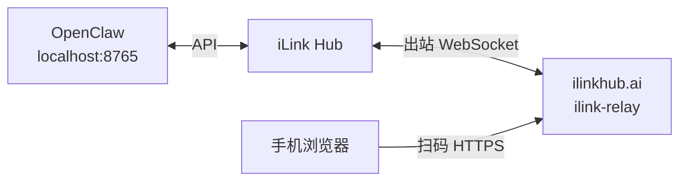

# 手机扫码配对（零配置）

本机运行 Hub 时，手机无法直接访问 `localhost`。**ilinkhub.ai** 上的配对中继（`ilink-relay`）只在绑定时转发确认页；日常 API 仍走本机。

## 用户只需配置

```bash
export WEIXIN_BASE_URL=http://127.0.0.1:8765
ilink-hub serve
```

首次启动会自动：

1. 生成并保存设备身份（`~/.local/share/ilink-hub/device_identity.json`，含 Ed25519 密钥对）
2. 用签名向中继注册 `device_id`，防止他人抢占
3. 出站连接 `wss://ilinkhub.ai/ws/pairing`
4. 二维码 URL 为 `https://ilinkhub.ai/pair/{device_id}/{code}`

无需 `HUB_PAIR_URL`、`TUNELY_TOKEN` 或单独跑隧道客户端。

## 架构



| 流量 | 路径 |
|------|------|
| `get_bot_qrcode` / `get_qrcode_status` / `getupdates` | 客户端 → `http://127.0.0.1:8765` |
| 配对确认页 | 手机 → `https://ilinkhub.ai/pair/{device_id}/...` → 中继 → 本机 Hub |
| 绑定完成后 | 仅 localhost，中继可断开 |

## 禁用中继（离线开发）

```bash
export ILINKHUB_RELAY=0
ilink-hub serve
# 二维码回退为 http://127.0.0.1:8765/...（仅本机调试）
```

## 自定义公网中继地址

```bash
export ILINKHUB_RELAY_URL=https://ilinkhub.ai
```

## 服务端部署

公网主机部署 `ilink-relay`（见 `scripts/deploy-relay.sh`）：

```bash
./scripts/deploy-relay.sh
```

健康检查：`https://ilinkhub.ai/health` → `{"status":"healthy","service":"ilink-relay"}`

## 客户端体验（OpenClaw 同款）

标准 iLink 登录协议：

1. 客户端向 **Hub** 调 `get_bot_qrcode`（GET 或 POST，OpenClaw 用 POST）
2. 响应里的 `qrcode_img_content` 是公网配对 URL
3. 客户端把该 URL **编码成终端二维码**（不是下载图片）
4. 手机扫码 → 浏览器打开 `ilinkhub.ai` 确认页
5. 客户端向 **Hub** 轮询 `get_qrcode_status`，直到 `confirmed` + `bot_token`

Hub 已兼容：

| 能力 | 说明 |
|------|------|
| POST `get_bot_qrcode` | 接受 OpenClaw 的 `local_token_list` 请求体 |
| `scaned` 状态 | 与腾讯 iLink 拼写一致（非 `scanned`） |
| 长轮询 | `get_qrcode_status` 在 `wait` 时 hold 最多 25s |

### Rust 客户端

```rust
use ilink_hub::client::{HubPairingClient, HubPairingOptions};

let creds = HubPairingClient::new(HubPairingOptions::new("http://127.0.0.1:8765"))
    .pair()
    .await?;
// creds.token → WEIXIN_TOKEN
```

或直接跑 Echo 示例：`examples/wechatbot-echo`（`cargo run`，仅设 `WEIXIN_BASE_URL`）。

### OpenClaw / Recursive

配对完成后，改 `base_url` 指向 Hub 即可透明收发消息。

首次扫码配对时，客户端须对 `get_bot_qrcode` / `get_qrcode_status` 使用配置的 Hub 地址（`http://127.0.0.1:8765`），而非 `ilinkai.weixin.qq.com`。Hub 侧协议已对齐；若插件登录仍走腾讯域名，需在插件侧改用 `baseUrl`（消息 API 改地址本身已足够用于已配对场景）。

## 验证

```bash
curl -s http://127.0.0.1:8765/ilink/bot/get_bot_qrcode | jq .qrcode_img_content
# 应输出: "https://ilinkhub.ai/pair/{uuid}/{code}"
```

用手机打开该 URL，填写客户端名称并确认；本机客户端轮询到 `confirmed` 后即可使用。

## 安全机制

| 机制 | 说明 |
|------|------|
| Hub 注册签名 | 连接中继须用本机私钥签名，他人无法冒用 `device_id` |
| 路径白名单 | Hub 只响应中继转发的 `/hub/pair/*`，拒绝其他路径 |
| 速率限制 | 公网侧按 IP 限制 WS 握手与配对 HTTP 请求 |
| 配对码 TTL | 单次配对码 10 分钟有效，128-bit 随机，难以猜测 |

手机侧仍依赖「谁拿到二维码谁可确认」——请勿泄露配对页面截图。
